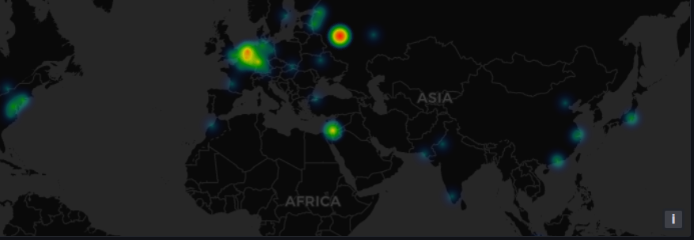
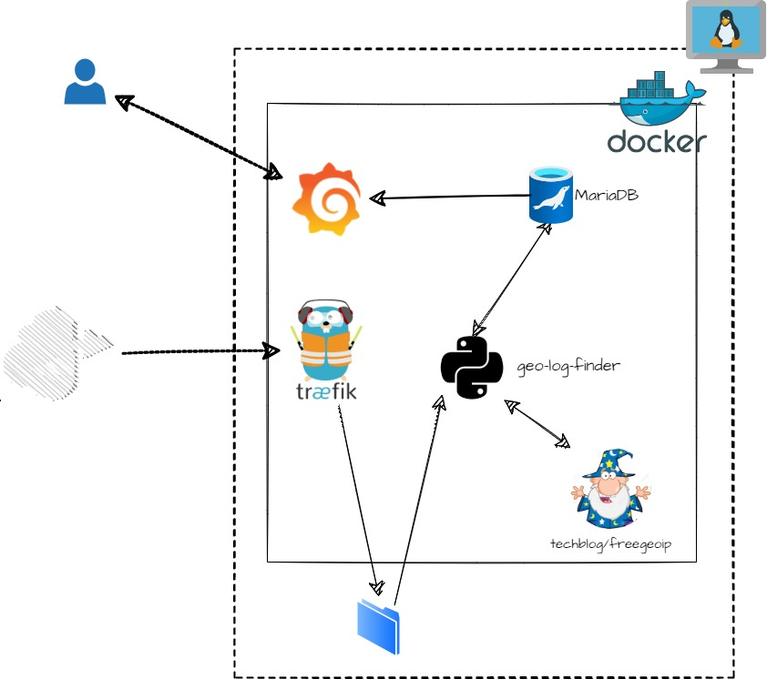

[](https://github.com/AdamRussak/geo-log-finder/actions/workflows/docker-publish.yml)

# Geo-log-finder


## About:
This Setup allows you to use the  [Traefik Access Logs](https://doc.traefik.io/traefik/observability/access-logs/) in [Grafana GeoMap](https://grafana.com/docs/grafana/latest/visualizations/geomap/).<br>
using only:
- Docker
- Docker-Compose
- mariaDB 
- [techblog/freegeoip](https://github.com/t0mer/freegeoip)
- Geo-log-finder Container.


## Pre-Spin up:
> **_NOTE_**: exaple assume this is already installed: <br>  
> * docker <br>
> * docker-compose <br>
> * Traefik installed <br>

### Traefik:
  in youre Traefik deployment add export of Access logs:<br>
 ```yaml
 #add in your deployment:
 command:
    - "--log.level=info"
    - "--log.format=json"
    - "--accesslog.filepath=/opt/logs/access.log"
    - "--accesslog.fields.headers.defaultmode=keep"
    - "--accesslog.format=json"
    - "--accesslog.bufferingsize=100"
    - "--accesslog=true"
  volumes:
    - /path/to/AccesLog/in/host:/opt/logs

 ```
#### Set Logrotate:
1. on your HOST open logrotate.conf, usaly at: `/etc/logrotate.conf`
2. add a logrotate config:
```bash
/path/to/logs/on/host/*.log {
  size 5M
  create 644 root root
  rotate 5
  notifempty
  postrotate
        sudo docker kill --signal="USR1" <TreafikContianerName>
  endscript
}
```
> link for [logrotate man page](https://linux.die.net/man/8/logrotate)

## Spin-up:
#### Must-have Environment variables:
- logLocation
- dbUser
- dbPass
- dbHost
- dbPort
- dbTable
- dbName
- geoIpUrl

### Grafan-Setup:
* Clone the Repo
    ```bash
    $ git clone https://github.com/AdamRussak/geo-log-finder && cd ./geo-log-finder
    ```
* Change the Environment variables in the .env file.

    Here you can find the **.env** file: [.env](./.env)
* Spin up your environment
    ```bash
      $ docker-compose up -d 
    ```
#### Docker-Compose Template:
link to the [docker-compose.yml](./docker-compose.yml)
```yaml
version: "3.8"

services:
  geo-log-finder:
    image: techblog/geo-log-finder
    container_name: geo-log-finder
    restart: always
    environment:
        - logLocation=/opt/log/<NameOfAccesLog>
        - dbUser=${_APP_DB_PASS}
        - dbPass=${_APP_DB_PASS}
        - dbHost=grafana-mariadb
        - dbPort=${_APP_DB_PORT}
        - dbName=${_GRAFANA_DB_SCHEMA}
        - dbTable=${_GRAFANA_DB_TABLE}
        - geoIpUrl=${_GEO_IP_URL}
    volumes:
        - /path/to/AccesLog/in/host:/opt/log:ro
  grafana-mariadb:
    image: mariadb:10.7.1
    container_name: grafana-mariadb
    restart: unless-stopped
    volumes:
    - grafana-mariadb:/var/lib/mysql:rw
    ports:
      - "3306:3306" #needed only for User Access, you can remove this part and the proccess will still work
    environment:
      - MYSQL_ROOT_PASSWORD=${_APP_DB_ROOT_PASS}
      - MYSQL_DATABASE=${_GRAFANA_DB_SCHEMA}
      - MYSQL_USER=${_APP_DB_USER}
      - MYSQL_PASSWORD=${_APP_DB_PASS}
    command: 'mysqld --innodb-flush-method=fsync'
  grafana-ui:
    image: grafana/grafana
    restart: always
    container_name: grafana-ui
    ports:
      - "3000:3000"
  freegeoip: #https://github.com/t0mer/freegeoip
    image: techblog/freegeoip
    container_name: freegeoip
    ports:
      - "8080:8080"
      - "8888:8888"
    restart: always
```
## Post-Spin-up:
* create Table inside MariaDB:
```sql
USE grafana
CREATE TABLE treafikAccessList_tbl(
    clientIP varchar(255) NOT NULL,
    clientState varchar(255) NOT NULL,
    ClientCity varchar(255) NOT NULL,
    ClientLatitude varchar(255) NOT NULL,
    ClientLongitude varchar(255) NOT NULL,
    featchDate date NOT NULL,
    timeStamp timestamp NOT NULL
    );
```
 > **_NOTE:_** its Advised to create a limited permissions user for the Process.
 ```sql
 -- create user with limited permissions
CREATE USER 'grafana_readonly'@'%' IDENTIFIED BY 'veryComplaxPassword!';
GRANT SELECT ON grafana.* TO 'grafana_readonly'@'%';
FLUSH PRIVILEGES;
 ```

 ### Grafana Data Source:
 * set MariaDB as a MySQL data Source
    * host: "`<container-Name>:3306`"
    * Database: "`<DB Name>`"
    * User: "`MariaDB user`"
 ### Grafana Query:
 ```sql
 SELECT
UNIX_TIMESTAMP(`timeStamp`) as time_sec,
  `ClientLatitude` as latitude,
  `ClientLongitude` as longitude,
  COUNT(`clientIP`) AS value,
  `clientIP` as name
FROM treafikAccessList_tbl
WHERE $__timeFilter(`timeStamp`)
GROUP BY `clientIP`
ORDER BY `timeStamp` ASC
 ```